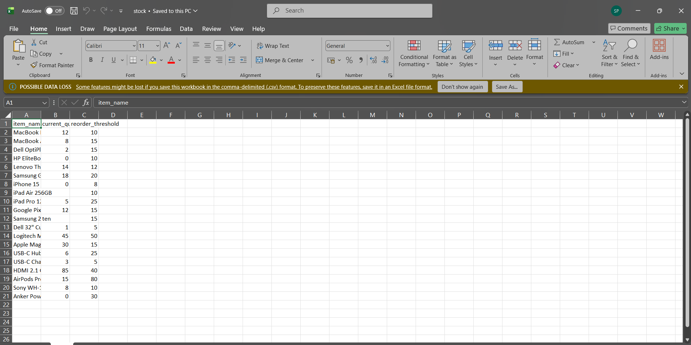
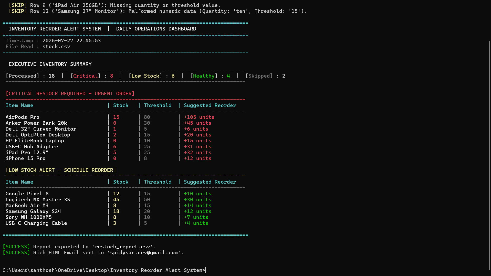
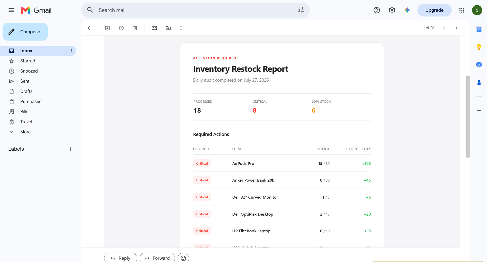
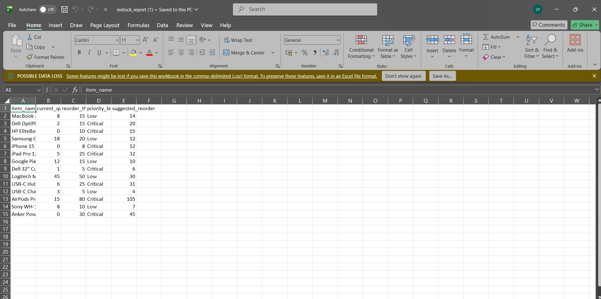

# Inventory Reorder Alert System

A small Python tool I built to stop manually eyeballing stock spreadsheets. It reads an inventory CSV, figures out which items are running low or critically low, prints a clean report straight in the terminal, saves a restock CSV, and emails an HTML alert so nobody has to go check the sheet by hand.

## Demo

Video walkthrough: [](https://youtu.be/2qWczktEIG0)

## What it does

- Reads `stock.csv` and validates each row — bad or incomplete rows get skipped instead of breaking the script
- Compares current quantity against each item's reorder threshold
- Splits flagged items into **Critical** and **Low** stock, and works out how much to reorder
- Prints a color-coded summary in the terminal (with a bit of a typewriter effect, mostly because it looks nice)
- Saves everything that needs reordering into `restock_report.csv`
- Sends an HTML email through Gmail with the same info, plus the CSV attached

## Screenshots

**Input CSV**


**Terminal output**


**Email alert**


**Excel view of the report**


## Project files

```
checker.py              main script, everything runs from here
stock.csv                your inventory data (input)
restock_report.csv       generated report of flagged items (output)
.env                     your email credentials, keep this local
```

## Requirements

Just Python 3.8+. No extra installs needed — it only uses the standard library (`csv`, `smtplib`, `email`, `os`, `sys`, `time`, `datetime`).

## Setting it up

1. Clone this repo and cd into it.

2. Make sure `stock.csv` is in the project folder with these three columns:

   ```csv
   item_name,current_quantity,reorder_threshold
   MacBook Pro 16",12,10
   Dell OptiPlex Desktop,2,15
   HP EliteBook Laptop,0,10
   ```

3. If you want the email alerts, create a `.env` file next to `checker.py`:

   ```env
   SENDER_EMAIL=youremail@gmail.com
   SENDER_PASSWORD=your_16_digit_app_password
   RECIPIENT_EMAIL=manager@example.com
   ```

   Use a [Gmail App Password](https://myaccount.google.com/apppasswords) here, not your normal password — you'll need 2-Step Verification turned on for that to work. If you skip this step entirely, the script still runs fine, it just won't send an email.

## Running it

```bash
python checker.py
```

That's it. It'll read the CSV, print the report, save `restock_report.csv`, and try to send the email if credentials are set.

## How the numbers work

An item gets flagged if `current_quantity < reorder_threshold`. From there:

- If quantity is at or below 25% of the threshold → **Critical**
- Otherwise → **Low**

Reorder amount is calculated so the item ends up at 150% of its threshold, not just barely above it:

```
target_stock = reorder_threshold * 1.5
suggested_reorder = target_stock - current_quantity
```

## Sample output

| item_name | current_quantity | reorder_threshold | priority_level | suggested_reorder |
|---|---|---|---|---|
| Dell OptiPlex Desktop | 2 | 15 | Critical | 20 |
| HP EliteBook Laptop | 0 | 10 | Critical | 15 |
| MacBook Air M3 | 8 | 15 | Low | 14 |
| Samsung Galaxy S24 | 18 | 20 | Low | 12 |

## Handling messy data

Real inventory sheets are never perfectly clean, so rows get skipped (with a warning printed) instead of crashing the script when:

- the item name is missing
- quantity or threshold is blank
- quantity or threshold isn't a valid number (e.g. someone typed "ten" instead of 10)
- quantity or threshold is negative

The final summary shows how many rows got skipped so nothing goes missing silently.

## License

MIT
